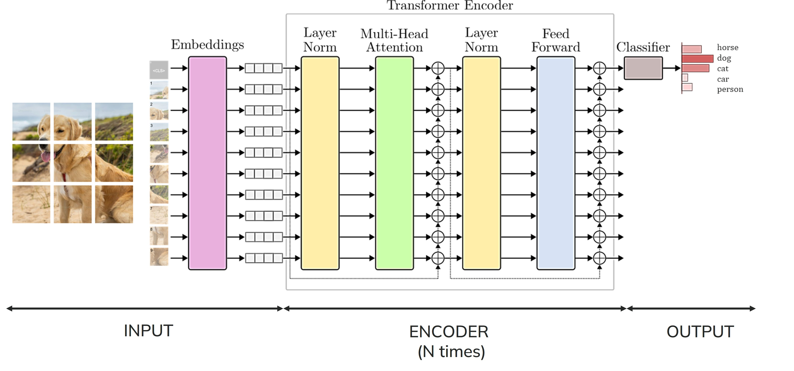

# Vision Transformer (ViT)

Implementazione da zero del Vision Transformer in PyTorch. 

## Componenti

- **Embedding Layer**: divide l'immagine in patch, le proietta in vettori 1D e aggiunge un CLS token e un positional embedding addestrabile.
- **Scaled Dot-Product Attention**: calcola la similarità tra query e chiavi per estrarre i valori rilevanti in modo differenziabile.
- **Attention Head**: proietta l'input in Q, K, V e applica la scaled dot-product attention.
- **Multi-Head Attention**: esegue N attention head in parallelo su sottospazi diversi e ne concatena l'output.
- **FeedForward**: MLP a due strati con attivazione GeLU e dropout.
- **Transformer Encoder**: combina Multi-Head Attention e FeedForward con connessioni residuali e Layer Normalization.
